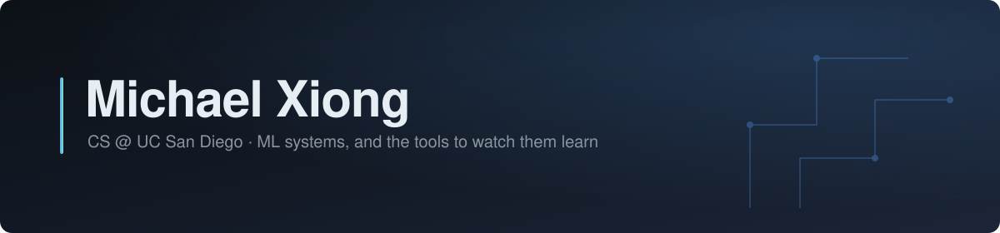

Computer Science major student at UC San Diego with a focus on applied AI and software engineering. I build end-to-end systems from IoT dashboards to ML pipelines working as a solo app developer and team researcher in the Center for Mathematical Artifical Intelligence at The Chinese University of Hong Kong.

Currently: Recreating RFT results from [Understanding Data Influence in RFT](https://proceedings.neurips.cc/paper_files/paper/2025/file/3755a02b1035fbadd5f93a022170e46f-Paper-Conference.pdf) 

---

### Selected work

| Project | What it is | Stack |
| --- | --- | --- |
| **[wind-farm-agent](https://github.com/mxiong9876/wind-farm-agent)** | Multimodal condition monitoring for wind turbines. SCADA, vibration, imagery, and acoustic streams are encoded separately, fused into a single per-turbine health state, and read out by task heads or a frozen LLM that writes the maintenance assessment. Trained on the Kelmarsh open dataset. | PyTorch, DINOv2, TCN |
| **[triton-dining-dashboard](https://github.com/mxiong9876/triton_dining_dashboard)** | Personal analytics for UCSD dining. Import your Triton2Go / Transact receipts and see total spend, favorite halls, and when you actually eat. | React, Vite, Recharts, Tailwind |
| **[llm-personalization](https://github.com/mxiong9876/LLM_Personalization---ACM-AI-Team4)** | ACM AI research team project on personalized LLMs. I built the data pipeline that turns the raw Enron corpus into LaMP-style user profiles for fine-tuning. | Python, LaMP |

<!--

| **[rl-dashboard](https://github.com/mxiong9876/rl-dashboard)** | Live dashboard for Gymnasium training runs: metric curves over WebSocket, episode replay, and a trajectory blur that sharpens into the optimal path as the agent converges. | Python, FastAPI, React |
| **[enron-lamp](https://github.com/mxiong9876/enron-lamp)** | Turns the Enron email dump into LaMP-format JSON for personalization benchmarks. | Python |
-->

---

### Working with

**Languages** — Python · Java · C / C++ · JavaScript · SQL · C# 
**ML** — PyTorch · TensorFlow · Gymnasium · RAG / knowledge graphs 
**Tools** — Docker · Git · Vite · Unity

---

### Elsewhere

- **Email** — [mxiong9876@gmail.com](mailto:mxiong9876@gmail.com)
- **LinkedIn** — [linkedin.com/in/michael-xiong8](https://linkedin.com/in/michael-xiong8)
